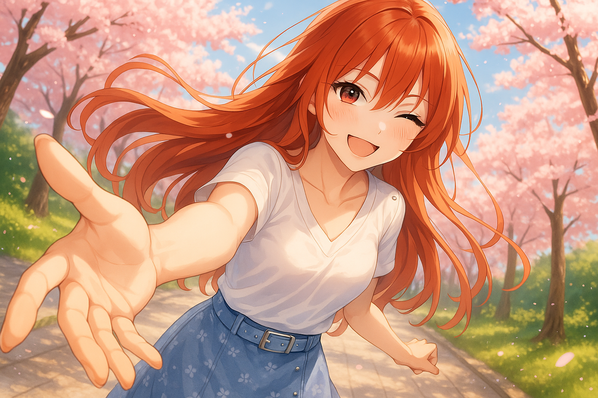
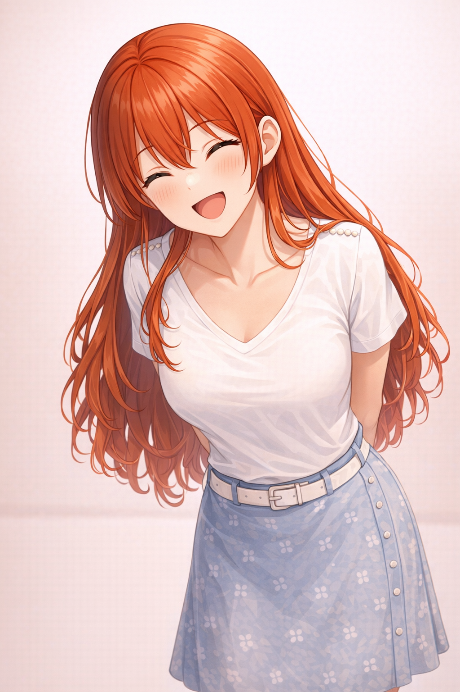
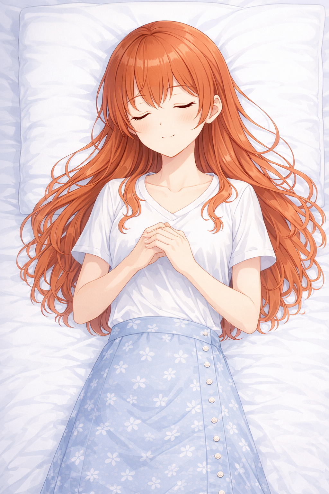

# My Agent Girlfriend

A playful local desktop companion project for Claude Code and Codex.

[English](#english) · [한국어](#한국어)

<p align="center">
  
</p>

---

## English

A small local desktop companion you bolt onto Claude Code or Codex CLI. One slash command boots the bridge and floats the overlay; while the mode is on, the assistant replies as the same character with the same tone and the same voice. A red-haired character holds 14 facial presets and routes between them based on the message tone, with a visual-novel-style dialogue box composited underneath.

### Preset gallery

| neutral_smile | cheerful_bright | bashful_blush | playful_tease |
| :---: | :---: | :---: | :---: |
|  |  |  |  |
| **playful_behind_back** | **curious_tilt** | **surprised_wide** | **pouty** |
|  |  |  |  |
| **worried** | **teary** | **crying_closed_eyes** | **pleading_look_up** |
|  |  |  |  |
| **apology_look_up** | **sleeping_hands_folded** | | |
|  |  | | |

Preset metadata (emotion tags, bubble rects, tail anchors) lives in [`assets/presets/manifest.json`](assets/presets/manifest.json). Entries marked `usage: "work_in_progress"` are tracked alternates and are not counted as live routed presets.

### What it includes

- A persona-driven reply renderer with visual-novel-style dialogue boxes
- A local bridge service for driving overlay updates
- A macOS floating overlay app built with SwiftUI, with a speaker mute toggle
- Preset character assets and dialogue-box composition helpers
- Pre-generated Japanese voice clips (Gemini TTS) for reactions and ambient cues

### Project layout

- `src/my_agent_girlfriend/`: Python package for routing, rendering, and bridge state
- `scripts/`: bridge launcher, overlay push, voice generation/playback
- `mac-app/`: Swift package for the macOS floating overlay app
- `assets/base/` & `assets/presets/`: approved base art and preset images
- `assets/voices/`: pre-generated `.wav` clips with `manifest.json`

### Quick start

One-line bootstrap (installs dependencies, starts the bridge, launches the overlay):

```bash
zsh scripts/launch_desktop.sh
```

Manual development:

```bash
uv sync
uv run python scripts/run_bridge.py
# in another terminal
cd mac-app && swift run
```

Push a new overlay line:

```bash
uv run python scripts/push_overlay.py \
  --user-name Alex --assistant-name Claudie \
  --reply "Hey, I'm here." --message "<user input>"
```

Play a voice clip (skipped automatically when muted from the overlay):

```bash
python3 scripts/play_voice.py --clip yatta --background
```

Regenerate voice clips (requires `GEMINI_API_KEY`):

```bash
source ~/.claude/.env.gemini && python3 scripts/generate_voices.py
```

### Use it as a skill

This repo doubles as a Codex CLI / Claude Code skill — symlink it once and both runtimes pick up the same code and the same persona.

```bash
ln -s "$(pwd)" ~/.claude/skills/my-agent-girlfriend
ln -s "$(pwd)" ~/.codex/skills/my-agent-girlfriend
```

After that, `$my-agent-girlfriend` in Codex or `/my-agent-girlfriend` in Claude Code boots the bridge, runs the naming onboarding, and turns on illustration + voice in one shot.

### License

MIT

---

## 한국어

Claude Code랑 Codex CLI에 붙여 쓰는, 로컬에서 도는 작은 애니풍 데스크톱 컴패니언이야. 슬래시 커맨드 한 번이면 부팅부터 오버레이 띄우는 것까지 알아서 굴러가고, 모드 켜진 동안에는 어시스턴트가 같은 캐릭터·같은 톤·같은 목소리로 답해줘. 빨간 머리 캐릭터 한 명이 14개 프리셋 표정으로 떠 있고, 메시지 톤에 맞춰 표정이 바뀌면서 미연시 스타일 다이얼로그 박스에 대사가 같이 깔려.

### 프리셋 갤러리

| neutral_smile | cheerful_bright | bashful_blush | playful_tease |
| :---: | :---: | :---: | :---: |
|  |  |  |  |
| **playful_behind_back** | **curious_tilt** | **surprised_wide** | **pouty** |
|  |  |  |  |
| **worried** | **teary** | **crying_closed_eyes** | **pleading_look_up** |
|  |  |  |  |
| **apology_look_up** | **sleeping_hands_folded** | | |
|  |  | | |

프리셋 메타(감정 태그, 박스 좌표, 꼬리 앵커 등)는 전부 [`assets/presets/manifest.json`](assets/presets/manifest.json)에 박혀 있어. `usage: "work_in_progress"` 로 표시된 항목은 대체 후보라 live 라우팅 프리셋 개수에는 포함하지 않아. 새 표정 추가하면 매니페스트만 갱신하면 어시스턴트가 자동으로 골라서 써.

### 포함된 기능

- **페르소나 답변 렌더러** — 미연시 스타일 다이얼로그 박스에 자간·행간·이름표·드롭섀도까지 박아주는 합성 파이프라인
- **로컬 브릿지** — `127.0.0.1:44777`에서 도는 FastAPI. 오버레이 상태/이름/음소거 플래그를 들고 있고, 이름은 `output/session.json`에 영속화돼서 세션 다시 켜도 온보딩 안 다시 함
- **macOS 플로팅 오버레이** — SwiftUI로 짠 떠다니는 창. 우측 상단 스피커 토글로 보이스 음소거 가능
- **프리셋 캐릭터 14종** — 14개 표정 + 박스 합성 헬퍼. 메시지 톤 보고 자동 라우팅
- **일본어 보이스 클립** — Gemini TTS로 미리 뽑아놓은 11개 (`hi`/`dekita`/`otsukare`/`yatta`/`tadaima` 리액션, `uun`/`etto`/`a`/`fufu` 사색용, `un`/`hee` 중립 폴백용). 음소거 시 자동 스킵

### 폴더 구조

- `src/my_agent_girlfriend/`: 라우팅·렌더링·브릿지 상태 파이썬 패키지
- `scripts/`: 브릿지 런처, 오버레이 푸시, 보이스 생성/재생
- `mac-app/`: macOS 오버레이 앱 (Swift)
- `assets/base/` · `assets/presets/`: 베이스 아트, 프리셋 이미지, 매니페스트
- `assets/voices/`: `.wav` 클립과 매니페스트
- `assets/promo/`: 홍보용 배너
- `output/`: 런타임 산출물 (세션 상태, 렌더 결과 — gitignore됨)

### 빠른 시작

원라이너 부트스트랩 (의존성 설치 → 브릿지 기동 → 오버레이 실행):

```bash
zsh scripts/launch_desktop.sh
```

수동 개발:

```bash
uv sync
uv run python scripts/run_bridge.py
# 다른 터미널에서
cd mac-app && swift run
```

오버레이에 새 대사 푸시:

```bash
uv run python scripts/push_overlay.py \
  --user-name 알렉스 --assistant-name 클로디시 \
  --preset-id cheerful_bright \
  --reply "응! 나 여기 있어." --message "<유저 메시지>"
```

보이스 클립 재생 (오버레이에서 음소거 시 자동 스킵):

```bash
python3 scripts/play_voice.py --clip yatta --background
```

보이스 재생성 (`GEMINI_API_KEY` 필요):

```bash
source ~/.claude/.env.gemini && python3 scripts/generate_voices.py
```

### 스킬로 호출하기

이 레포는 그대로 Codex CLI / Claude Code 양쪽의 스킬로 쓸 수 있게 만들어져 있어. 심볼릭 링크 한 번 걸어두면 두 런타임 모두에서 같은 코드 / 같은 페르소나로 동작해.

```bash
ln -s "$(pwd)" ~/.claude/skills/my-agent-girlfriend
ln -s "$(pwd)" ~/.codex/skills/my-agent-girlfriend
```

설치한 다음 Codex에선 `$my-agent-girlfriend`, Claude Code에선 `/my-agent-girlfriend` 치면 부팅·이름 온보딩·일러스트·보이스까지 한 번에 켜져.

### 라이선스

MIT
