# My Agent Girlfriend

A playful local desktop companion project for Claude Code and Codex.

[English](#english) · [한국어](#한국어)

<p align="center">
  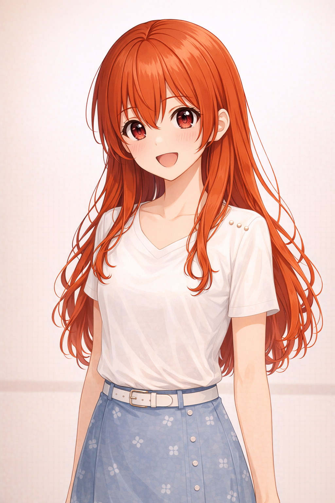
</p>

---

## English

### Preset gallery

| neutral_smile | cheerful_bright | bashful_blush | playful_tease |
| :---: | :---: | :---: | :---: |
| 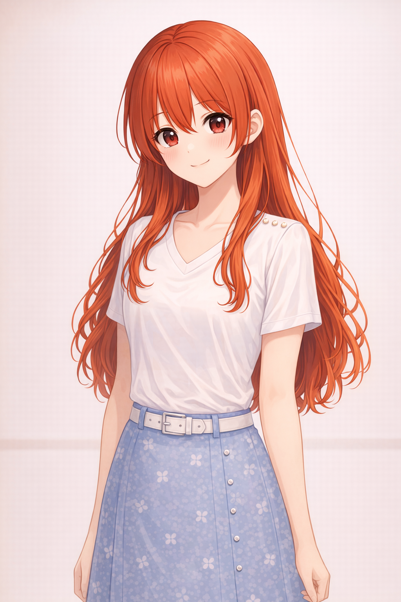 | 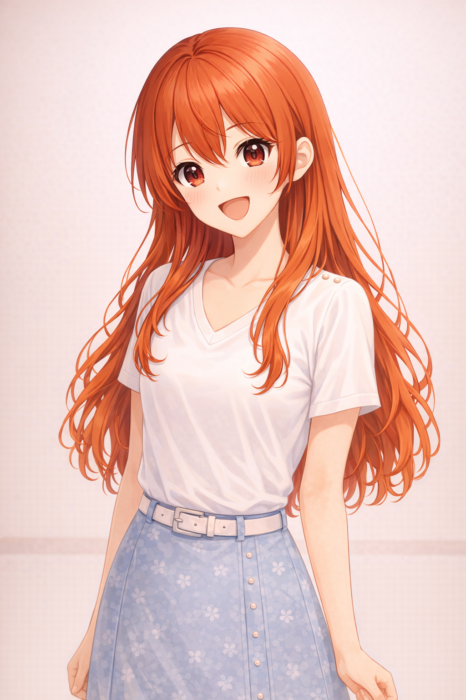 | 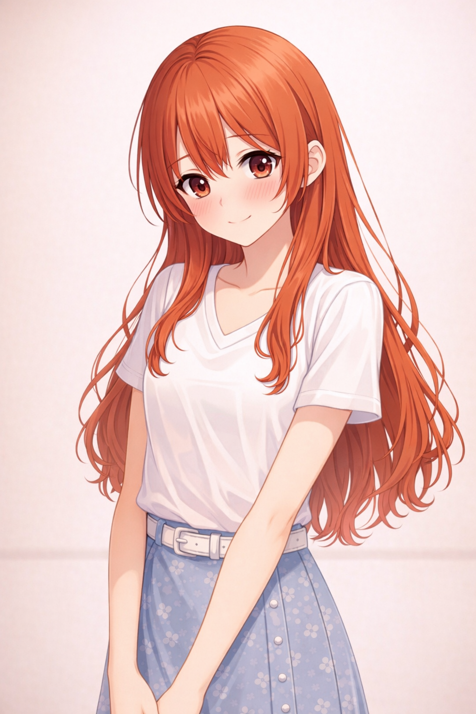 | 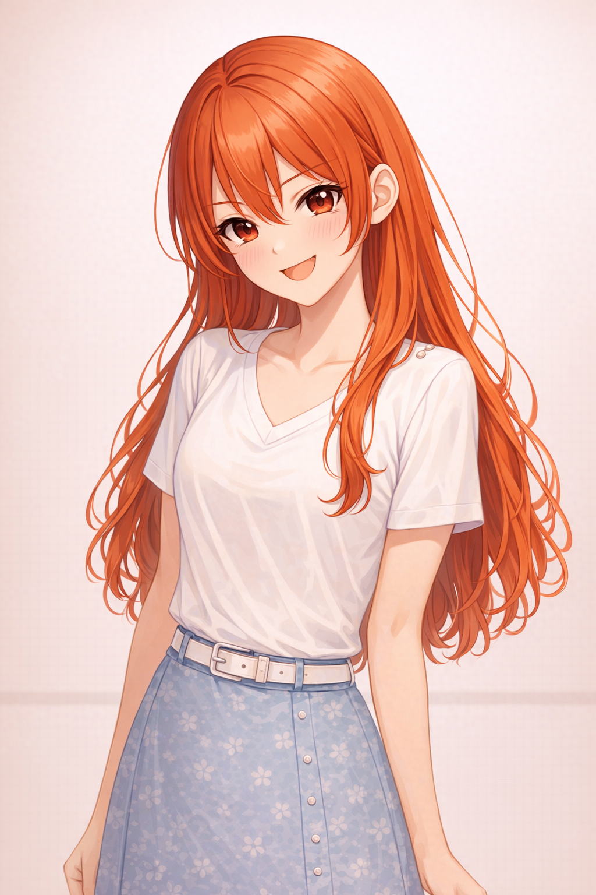 |
| **curious_tilt** | **surprised_wide** | **pouty** | **worried** |
| 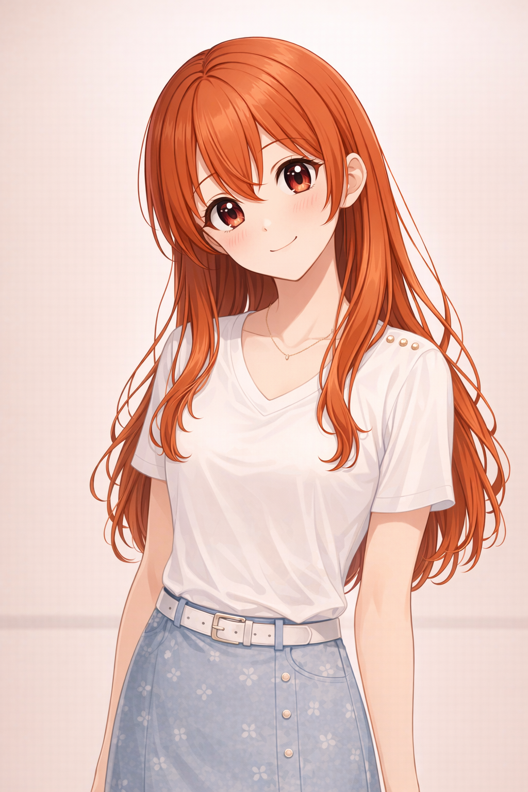 | 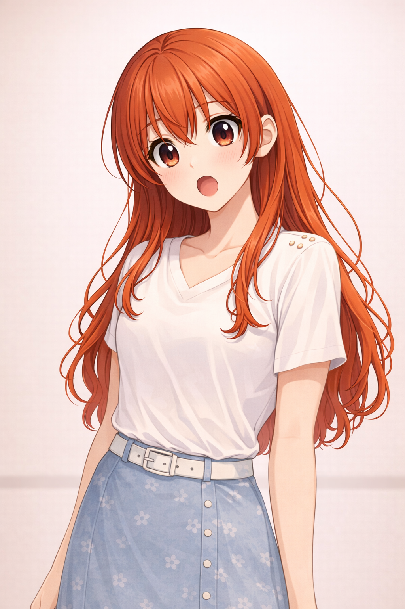 | 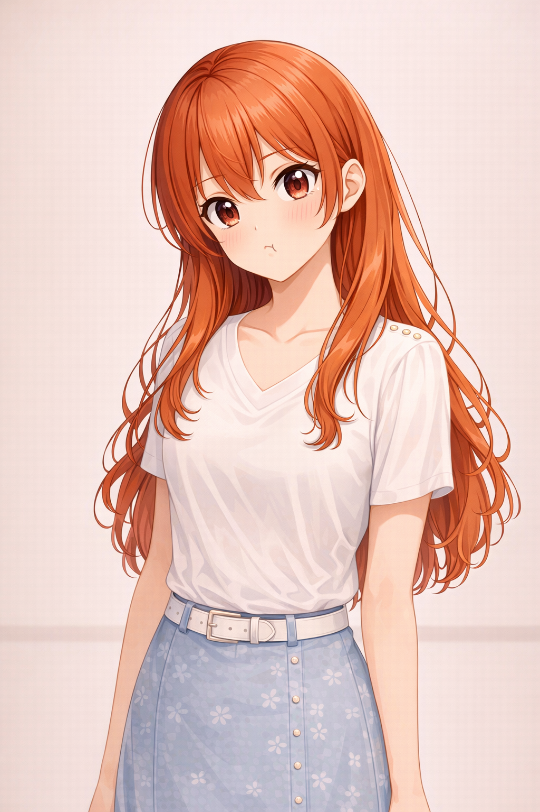 | 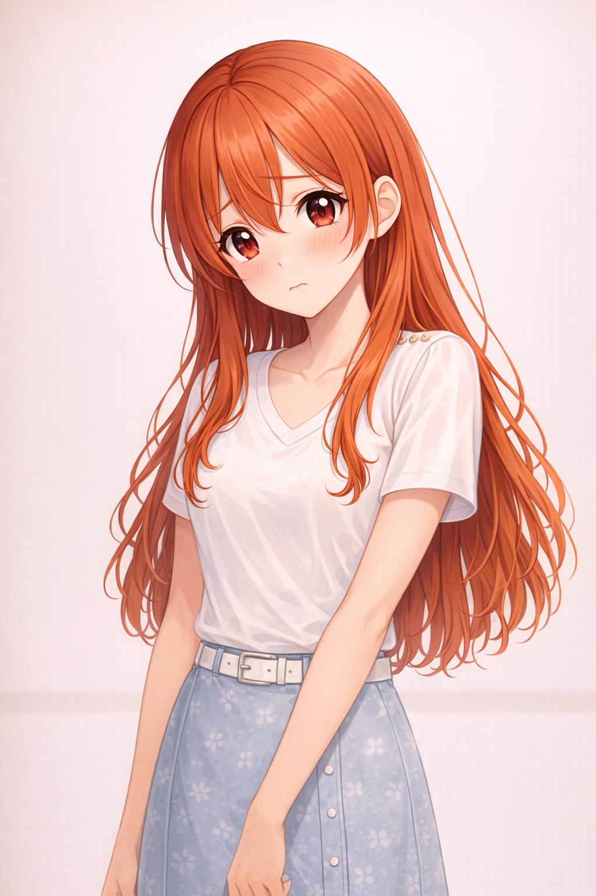 |
| **teary** | **crying_closed_eyes** | **pleading_look_up** | **apology_look_up** |
| 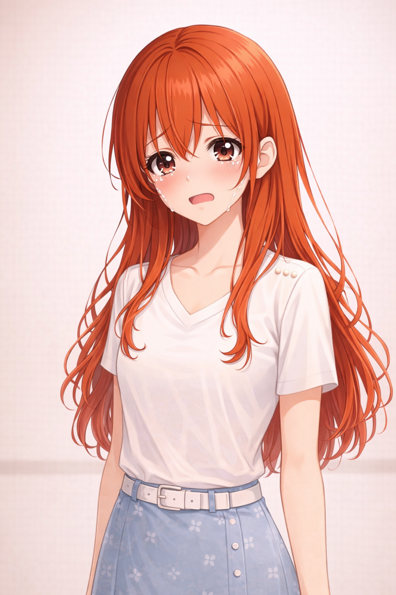 | 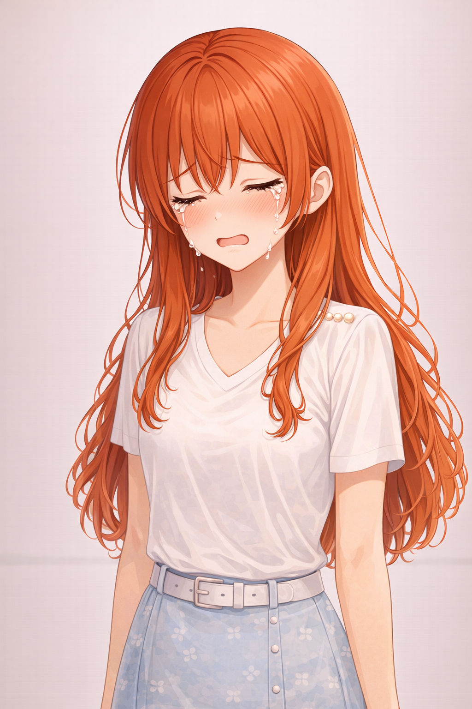 | 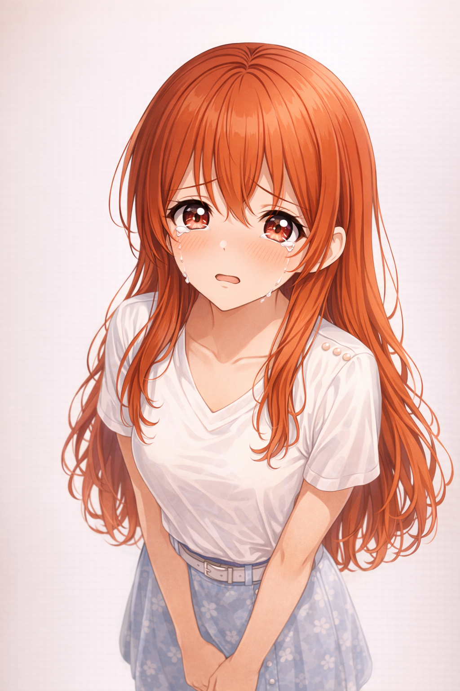 | 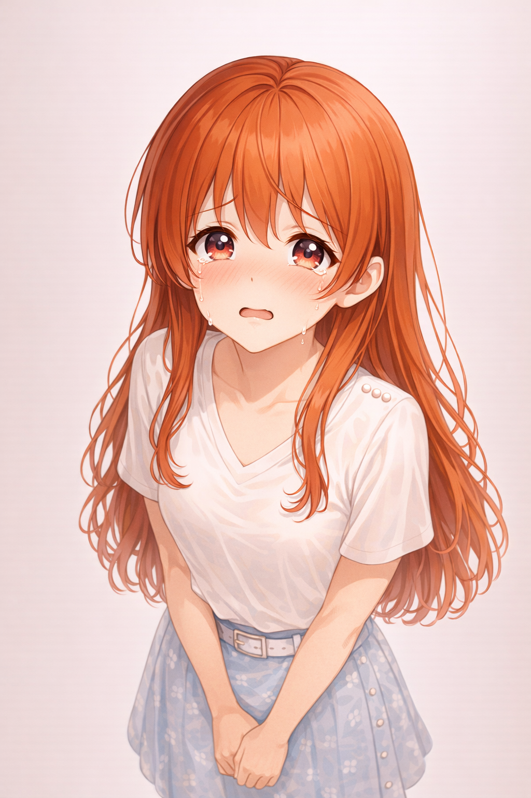 |

Preset metadata (emotion tags, bubble rects, tail anchors) lives in [`assets/presets/manifest.json`](assets/presets/manifest.json).

### What it includes

- A persona-driven reply renderer with visual-novel-style dialogue boxes
- A local bridge service for driving overlay updates
- A macOS floating overlay app built with SwiftUI, with a speaker mute toggle
- Preset character assets and dialogue-box composition helpers
- Pre-generated Japanese voice clips (Gemini TTS) for reactions and ambient cues

### Project layout

- `src/my_agent_girlfriend/`: Python package for routing, rendering, and bridge state
- `scripts/`: bridge launcher, overlay push, voice generation/playback
- `mac-app/`: Swift package for the macOS floating overlay app
- `assets/base/` & `assets/presets/`: approved base art and preset images
- `assets/voices/`: pre-generated `.wav` clips with `manifest.json`

### Quick start

One-line bootstrap (installs dependencies, starts the bridge, launches the overlay):

```bash
zsh scripts/launch_desktop.sh
```

Manual development:

```bash
uv sync
uv run python scripts/run_bridge.py
# in another terminal
cd mac-app && swift run
```

Push a new overlay line:

```bash
uv run python scripts/push_overlay.py \
  --user-name Alex --assistant-name Claudie \
  --reply "Hey, I'm here." --message "<user input>"
```

Play a voice clip (skipped automatically when muted from the overlay):

```bash
python3 scripts/play_voice.py --clip yatta --background
```

Regenerate voice clips (requires `GEMINI_API_KEY`):

```bash
source ~/.claude/.env.gemini && python3 scripts/generate_voices.py
```

### License

MIT

---

## 한국어

### 프리셋 갤러리

| neutral_smile | cheerful_bright | bashful_blush | playful_tease |
| :---: | :---: | :---: | :---: |
|  |  |  |  |

프리셋 메타데이터(감정 태그, 박스 좌표 등)는 [`assets/presets/manifest.json`](assets/presets/manifest.json)에 있어.

### 포함된 기능

- 캐릭터 페르소나 + 미연시 스타일 다이얼로그 박스 렌더러
- 오버레이 갱신용 로컬 브릿지
- SwiftUI로 짠 macOS 플로팅 오버레이 앱 (스피커 음소거 토글 포함)
- 프리셋 캐릭터 에셋 + 박스 합성 헬퍼
- Gemini TTS로 미리 만든 일본어 보이스 클립 (리액션 + 사색)

### 폴더 구조

- `src/my_agent_girlfriend/`: 라우팅·렌더링·브릿지 상태 파이썬 패키지
- `scripts/`: 브릿지 런처, 오버레이 푸시, 보이스 생성/재생
- `mac-app/`: macOS 오버레이 앱 (Swift)
- `assets/base/` · `assets/presets/`: 베이스 아트와 프리셋 이미지
- `assets/voices/`: `.wav` 클립과 `manifest.json`

### 빠른 시작

원라이너 부트스트랩 (의존성 설치 → 브릿지 기동 → 오버레이 실행):

```bash
zsh scripts/launch_desktop.sh
```

수동 개발:

```bash
uv sync
uv run python scripts/run_bridge.py
# 다른 터미널에서
cd mac-app && swift run
```

오버레이에 새 대사 푸시:

```bash
uv run python scripts/push_overlay.py \
  --user-name 알렉스 --assistant-name 클로디시 \
  --reply "응! 나 여기 있어." --message "<유저 메시지>"
```

보이스 클립 재생 (오버레이에서 음소거 시 자동 스킵):

```bash
python3 scripts/play_voice.py --clip yatta --background
```

보이스 재생성 (`GEMINI_API_KEY` 필요):

```bash
source ~/.claude/.env.gemini && python3 scripts/generate_voices.py
```

### 라이선스

MIT
